# REPORT
## Task

- The two services `accounts (2222)` and `web` are running and registered (two terminals, logs screenshots).
- The service registration service has these two services registered (a third terminal, dashboard screenshots)
- A second `accounts` service instance is started and will use the port 4444. This second `accounts (4444)` is also
  registered (a fourth terminal, log screenshots).
- What happens when you kill the service `accounts (2222)` and do requests to `web`?  
  Can the web service provide information about the accounts again? Why?

## First Task
First of all you will launch the Registration
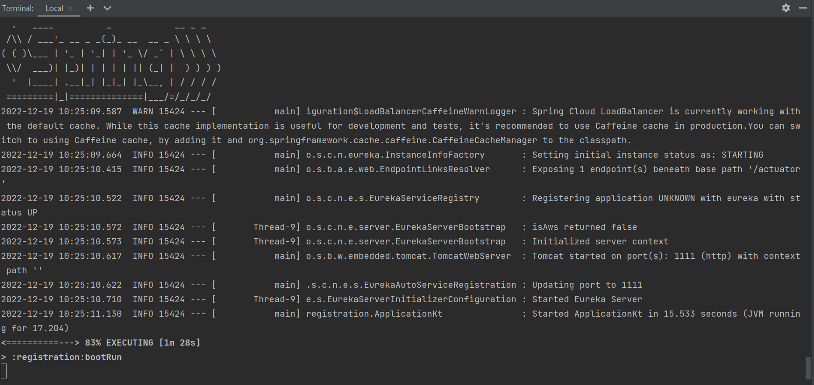

This is the log that you must see if the application is running well, and on the browser should show the next image
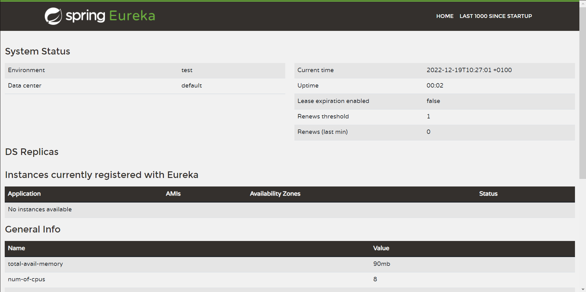

Now we could launch the services `accounts` at the port 2222 and 'web'
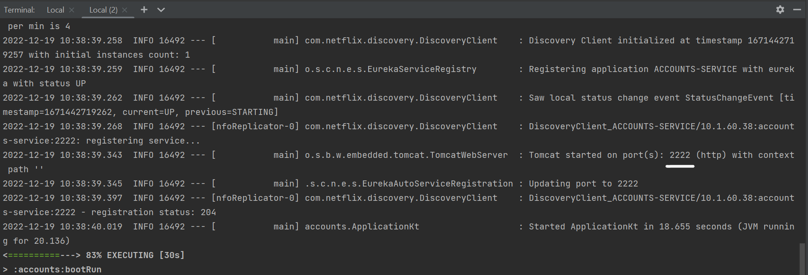

This is the log of the service accounts at the port 2222, and the next image is what you should see on your browser in the URL [localhost:2222](http://localhost:2222)
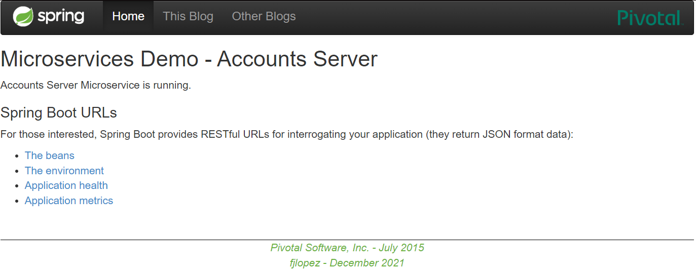

And finally the service `web` with the log what you should see on your terminal
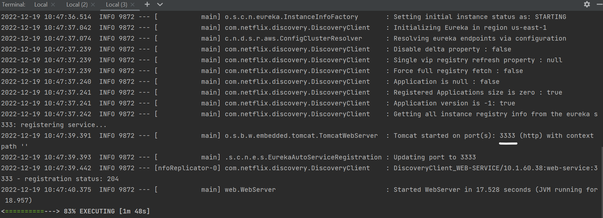

And the service on your browser in the URL [localhost:3333](http://localhost:3333)
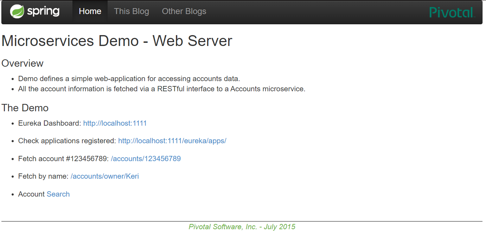

## Second task
As you can see on the browser in the URL of the registration service, the two services that you launched before are on the section of the web dedicated to the services registered with Eureka
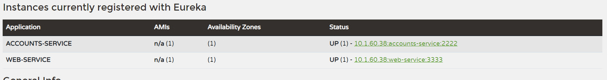

## Third task 
Now you will register another account at the port 4444, like you did before.
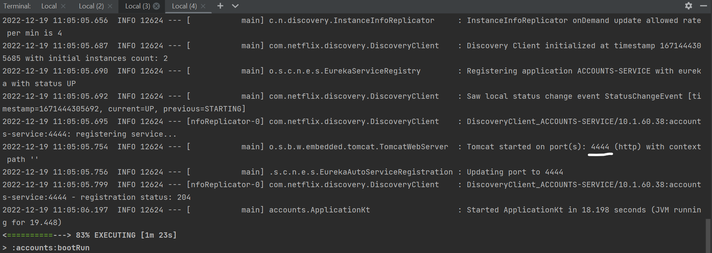

And on the Registration service you should see, that a new account was added to the list of services registered with eureka
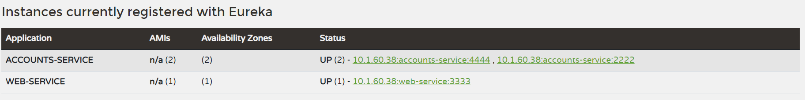

## Fourth task
On this task, first you will stop the account at the port 2222
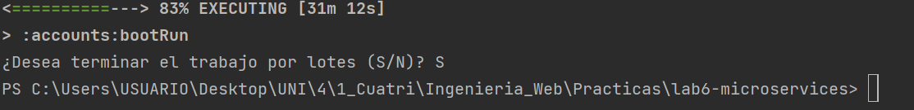

Now if you search the account at the port 2222, it will not appear
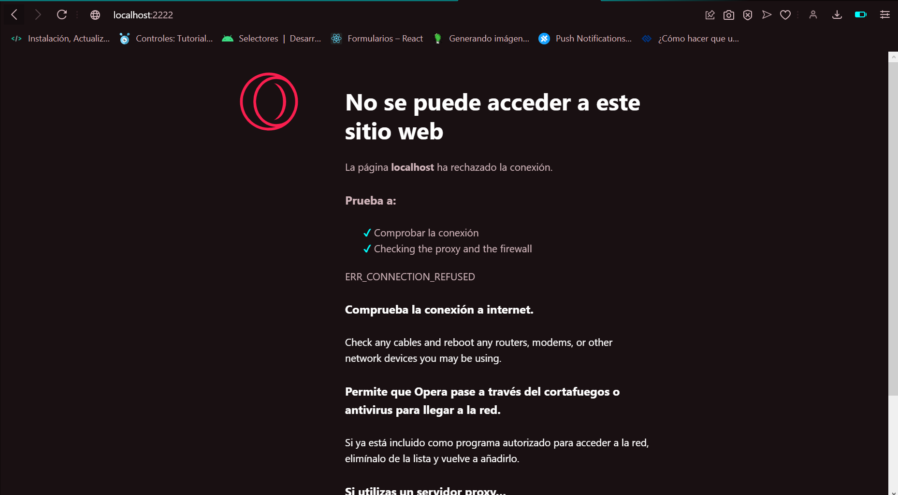

And if you do a request to web, it will show you the next image
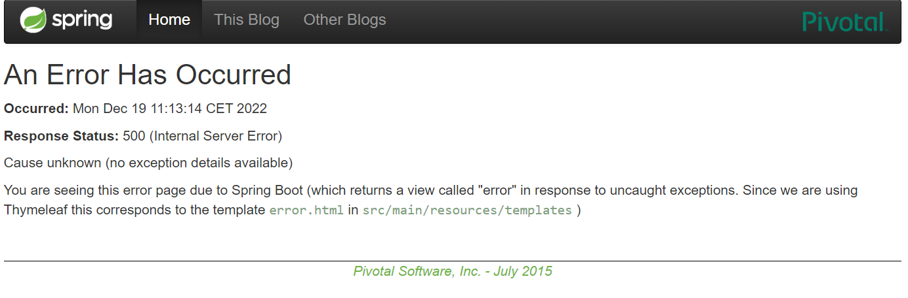

But if you do it again, this is what you will see
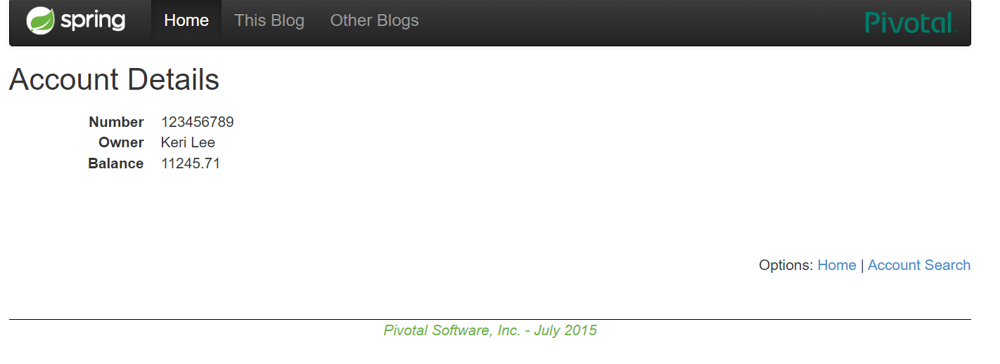

So, what happened?

Easy the account at the port 4444 is running, then eureka when it has tried to connect with the account:2222 and has failed, try to connect with the other account that it has registered.
And now all the request to the service account:2222 are redirected to the service account:4444 that is available, and its functionality is the same that the service accounts:2222.